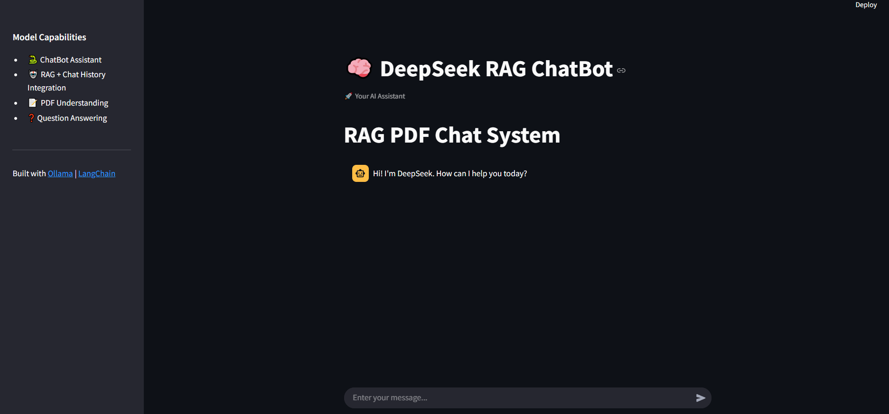
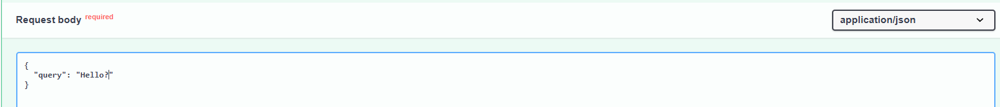

# 🚀 DeepSeek RAG Chatbot
**100% Open Source | Local PC Installation**

## 🔥 DeepSeek RAG: The Ultimate RAG Stack!

The **DeepSeek RAG Chatbot** is a powerful tool designed for fast, accurate, and explainable retrieval of information from PDFs. Leveraging **DeepSeek-7B**, **FAISS**, and **Chat History Integration**, this chatbot provides a seamless experience for document-based question answering and information retrieval.

## 🛠️ Tech Stack

- **Core Model**: DeepSeek-7B
- **Embedding Model**: paraphrase-multilingual-MiniLM-L12-v2
- **Framework**: Python
- **Model Deployment**: Ollama
- **Retrieval & Generation**: LangChain
- **Monitoring & Debugging**: LangSmith
- **UI Framework**: Streamlit
- **API Framework**: FastAPI
- **Vector Database**: FAISS
- **Containerization**: Docker
---

## 🛠️ Installation & Setup

### 1. Clone the Repository & Install Dependencies
Clone the repository
```bash
git clone https://github.com/AhmadHammad21/DeepSeek-RAG-ChatBot
cd DeepSeek-RAG-ChatBot
```

### 2. Create and activate a virtual environment
### Windows
```bash
python -m venv venv
venv/Scripts/activate
```

### Linux/macOS
```bash
python3 -m venv venv
source venv/bin/activate
```

### Install dependencies
```bash
pip install -r requirements.txt
```

### 3. Install & Set Up Ollama
Ollama is required to run DeepSeek-7B.

Installation on # Linux/macOS:
```bash

curl -fsSL https://ollama.com/install.sh | sh

```

Pull the required model:
```bash
ollama pull deepseek-r1:7b
```

### 4. (Optional) Enable LangSmith for Model Monitoring

To enable LangSmith tracing, create a .env file and add your API key and project name:
```bash
LANGSMITH_TRACING=true
LANGSMITH_ENDPOINT="https://api.smith.langchain.com"
LANGSMITH_API_KEY="YOUR_API_KEY"
LANGSMITH_PROJECT="YOUR_PROJECT_NAME"
```

# 🚀 Running the Chatbot

### Run the Streamlit Chatbot UI
```bash
streamlit run app.py
```
🖼️ Example:



### Run the FastAPI Server
```bash
uvicorn api.main:app --host 0.0.0.0 --port 8000 --reload
```
📌 Access Swagger API Documentation: http://localhost:8000/docs
🖼️ Example:



### Run via Docker
```bash
# Build the Docker image
docker build -t rag-api .

# Run the container
docker run -p 8000:8000 rag-api
```

## How It Works

- Upload Documents: Place your PDFs in the `data/docs/ ` directory.

- Run the Application: Start the Streamlit UI or FastAPI server.

- Retrieval & Generation: The chatbot retrieves the most relevant document chunks and generates responses using `DeepSeek-7B`.

### Future Enhancements

- 💻 Fine-Tune the DeepSeek Model.

- 📂 Support additional document formats (DOCX, TXT, etc.).

- 🔍 Implement Neural Reranking for improved search accuracy.

- 🤖 Explore HyDE (Hypothetical Document Embeddings).

- 🕸️ Integrate GraphRAG for enhanced knowledge structuring.

- 📌 Contributions Welcome! 🚀 Feel free to fork, improve, and submit pull requests. Happy coding! 🎯